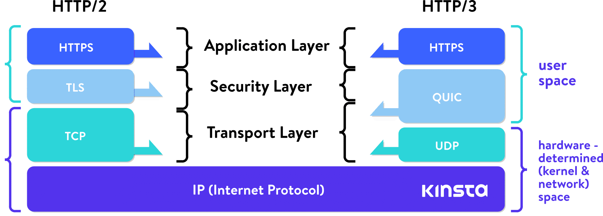

# Overview

## Sweets spots of Go

* Why Go?

### Compiling cross-platform binaries

* `GOOS` & `GOARCH` environment variables

### Concurrency vs Parallelism

OS Overview

> Image Credits: https://github.com/sathishvj/optimizing-go-programs#m-p-g

Concurrency vs Parallelism

> Image Credits: https://github.com/sathishvj/optimizing-go-programs#m-p-g

* Overview of Go scheduler

OS vs Go Scheduler

> Image Credits: https://speakerdeck.com/kavya719/the-scheduler-saga?slide=15

OS Thread & Go Routine Scheduling

> Image Credits: https://speakerdeck.com/kavya719/the-scheduler-saga?slide=18

* `GOMAXPROCS` controls the max number of OS threads a go program can create

### Other Packages

* `context` package
  * Useful for signaling multiple goroutines at the same time
  * Useful for controlling goroutine execution
  * Useful for sharing values across goroutine boundaries

---

## Building Services

### OSI Layers

> Image Credits: https://www.bmc.com/blogs/osi-model-7-layers/

### ReST

* Works well with HTTP 1.1
* Usually, is JSON based, protobuf is rarely used

### gRPC

* Works on top of HTTP 2
* Usually, uses protobuf for messaging, JSON is optional

### HTTP 1.1 vs HTTP 2 Service (Layer 5, 6 & 7)

> Image Credits: https://blog.cloudflare.com/introducing-http2/

* Text-based protocol
* Human readable
* Useful for application to application communication

#### HTTP 2

* Secure by default
  * opportunistic encryption (*TLS for http:// URLs*)

#### HTTP 3

> Image Credits: https://kinsta.com/blog/http3/

### TCP vs UDP Service (Layer 4)

> Image Credits: https://www.cloudflare.com/learning/ddos/glossary/user-datagram-protocol-udp/

* Ports are defined at this layer
* Allows for process to process communication

### IP (Layer 3)

> Image Credits: https://www.comparitech.com/blog/vpn-privacy/ipv6-vs-ipv4/

* Provides logical addressing
* Datagram sequencing

---
